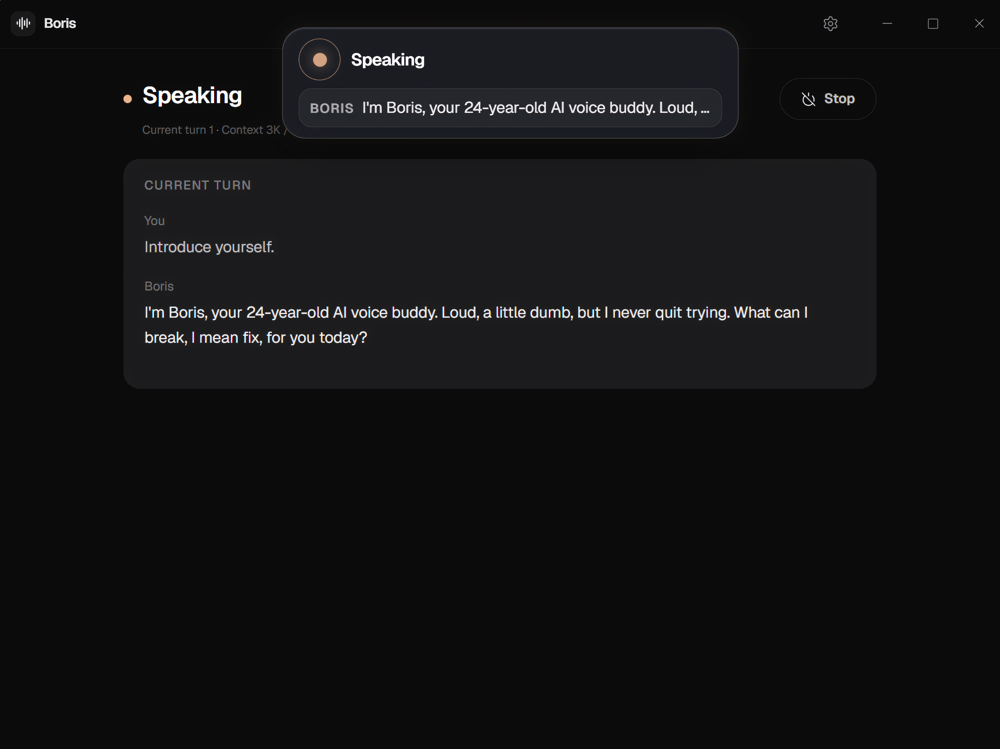

<p align="center">
  
</p>

<h1 align="center">Boris</h1>

<p align="center">
  A Windows-first desktop voice assistant that can actually help.<br>
  <strong>Wake → listen → transcribe → tools → speak.</strong>
</p>

<p align="center">
  <a href="https://github.com/blocksdevpro/boris-assistant/releases/latest"></a>
  <a href="https://github.com/blocksdevpro/boris-assistant/releases"></a>
  <a href="LICENSE"></a>
  
  
</p>

<p align="center">
  <a href="https://github.com/blocksdevpro/boris-assistant/releases/latest"><strong>Download for Windows</strong></a>
  ·
  <a href="CHANGELOG.md">Changelog</a>
  ·
  <a href="desktop/README.md">Desktop notes</a>
  ·
  <a href="CONTRIBUTING.md">Contributing</a>
</p>

<p align="center">
  
</p>

Local wake, speech-to-text, and speech output. Your choice of cloud model. Tools that ask before they do something risky.

The product is **Boris Desktop** (`desktop/` → `boris-desktop`). Voice and agent logic live in the Rust workspace under `crates/`.

| Channel | Version | Get it |
|---|---|---|
| **Stable** | [1.0.0](https://github.com/blocksdevpro/boris-assistant/releases/tag/v1.0.0) | [Latest release](https://github.com/blocksdevpro/boris-assistant/releases/latest) — NSIS or MSI |
| **Beta** | [1.1.0-beta.1](https://github.com/blocksdevpro/boris-assistant/releases/tag/v1.1.0-beta.1) (published) | Pre-release installer, or **Settings → Updates → Channel → Beta** |
| **This tree** | **1.1.0-beta.2** | Source / `bun run tauri build` |

Workspace crates are `publish = false`. They ship inside the desktop app, not on crates.io.

---

## Install

Windows 10 or 11, x64, with a working mic and speakers.

1. Download **`Boris_*_x64-setup.exe`** from [Releases](https://github.com/blocksdevpro/boris-assistant/releases).
2. Run the installer (you can install a beta over 1.0.0).
3. On first launch, finish **model install** and set an [OpenRouter](https://openrouter.ai/) API key in Settings.

Signed in-app updates poll GitHub Releases. **Stable** uses `/releases/latest`. **Beta** uses the long-lived [`beta`](https://github.com/blocksdevpro/boris-assistant/releases/tag/beta) pre-release feed. Pick the channel in **Settings → Updates → Channel**.

Windows **1.1 betas ship NSIS only**. WiX/MSI cannot encode a label like `1.1.0-beta.1`.

Packaged builds have no console. Logs land at `%USERPROFILE%\.boris\logs\boris-desktop.YYYY-MM-DD.log`.

---

## Features

- **Hands-free loop** — wake word, VAD capture, local STT, agent turn, local TTS playback
- **Voice island** — always-on-top overlay for listening / thinking / speaking, plus live captions
- **Tool-using agent** — files, glob/grep, shell (HITL), web search and fetch, clipboard, memory, skills, sessions, todos
- **Capability presets** — `voice_safe` / `local_power` / `full` plus path policy and human approval for risky work
- **Local models** — LiveKit-style wake (ONNX), NVIDIA Parakeet STT, Supertone TTS
- **Your model** — OpenRouter (OpenAI-compatible) via `boris-ai`; audio stays on the machine
- **Web search without a key** — DuckDuckGo + Wikipedia by default; an Exa key is an optional upgrade *(1.1)*
- **Session artifacts** — markdown and code cards on the overlay and Home desk; spoken replies stay short *(1.1)*
- **User home** — `%USERPROFILE%\.boris` for config, keys, models, logs, sessions, memory, skills, workspace

---

## How a turn works

```text
Armed  →  wake  →  Hearing  →  Reading  →  Thinking  →  Talking  →  AwaitingReply
   │                    │           │            │            │
   │                    VAD        Parakeet     agent +      Supertone
   │                                           tools         playback
   └──────── AwaitingConfirm (HITL yes / no) ─────────────────┘
```

Wake scoring, capture, STT, the agent, and TTS all run on **one engine thread**, sequentially. That is intentional — not a worker mesh or event-bus.

---

## Architecture

```text
┌─────────────────────────────────────────────────────────────┐
│  desktop/  (React + Vite + Bun + Tauri v2)                  │
│    UI  ↔  IPC  ↔  boris-desktop (src-tauri)                 │
│    main window · overlay island · tray · updater            │
└────────────────────────────┬────────────────────────────────┘
                             │
                             ▼
┌─────────────────────────────────────────────────────────────┐
│  boris-pipeline  — single engine thread, sequential turns   │
│    Off → Quiet → Armed → Hearing → Reading → Thinking       │
│         → Talking → AwaitingReply / AwaitingConfirm         │
└───────┬───────────────┬───────────────┬─────────────────────┘
        │               │               │
        ▼               ▼               ▼
  boris-audio     boris-sense     boris-agent
  (cpal I/O)      (VAD + wake)    (ReAct + tools)
        │               │               │
        └───────┬───────┘               ▼
                │                 boris-ai (OpenRouter)
                ▼
        boris-inference (STT/TTS ports)
                │
     ┌──────────┴──────────┐
     ▼                     ▼
 boris-stt-parakeet   boris-tts-supertone
                      (boris-tts-kokoro experimental)
                │
                ▼
           boris-core  (shared types / errors)
```

| Crate | Role |
|-------|------|
| [`boris-core`](crates/boris-core) | Shared audio aliases, `TurnId`, foundation errors |
| [`boris-audio`](crates/boris-audio) | Capture / playback, resample to 16 kHz mono |
| [`boris-sense`](crates/boris-sense) | VAD + wake-word adapters, ORT init |
| [`boris-inference`](crates/boris-inference) | Object-safe STT / TTS traits |
| [`boris-stt-parakeet`](crates/boris-stt-parakeet) | Parakeet ONNX speech-to-text |
| [`boris-tts-supertone`](crates/boris-tts-supertone) | Product TTS (default) |
| [`boris-tts-kokoro`](crates/boris-tts-kokoro) | Experimental Kokoro adapter |
| [`boris-ai`](crates/boris-ai) | LLM client plane (OpenRouter) |
| [`boris-agent`](crates/boris-agent) | Tool runtime, policy, memory, sessions, artifacts |
| [`boris-pipeline`](crates/boris-pipeline) | Desktop voice engine + `~/.boris` + model install |
| [`boris-desktop`](desktop/src-tauri) | Tauri shell, tray, overlay, updater, packaging |

---

## Build from source

**Prerequisites**

- Windows (primary target — mic/speaker, ORT / DirectML packaging)
- [Rust](https://rustup.rs) — [`rust-toolchain.toml`](rust-toolchain.toml) pins **1.97.1** (MSRV 1.97)
- [Bun](https://bun.sh)
- [Tauri v2 platform deps](https://v2.tauri.app/start/prerequisites/)
- An [OpenRouter](https://openrouter.ai/) API key (or compatible setup)

```bash
git clone https://github.com/blocksdevpro/boris-assistant.git
cd boris-assistant

cp .env.example .env
# edit .env — OPENROUTER_API_KEY=...  (also settable in the app)

cd desktop
bun install
bun run tauri dev
```

Release build:

```bash
cd desktop
bun run tauri build
```

More packaging, updater signing, and log detail: [`desktop/README.md`](desktop/README.md).

> The root package `boris-assistant` is a **retired CLI stub**.  
> `cargo run` at the repo root prints a message and exits — it does **not** start the voice app.

### Rust workspace

```bash
# Library crates (no Tauri UI)
cargo test -p boris-core -p boris-ai -p boris-agent --lib
cargo test -p boris-audio -p boris-sense -p boris-inference --lib
cargo test -p boris-pipeline --lib
cargo check -p boris-pipeline --features stt-parakeet,tts-supertone

# Full product (needs the tracked wake ONNX + frontend toolchain)
cargo check -p boris-desktop
```

Crate-level docs live in each `crates/*/README.md`.

---

## Models

| Model | When needed | How |
|-------|-------------|-----|
| **Wake** (`boris-large.onnx`) | **Compile** of `boris-desktop` | Tracked release asset, embedded via `include_bytes!` from `assets/models/livekit/` |
| **Parakeet STT** | Runtime | App install / HF download into `~/.boris/models/parakeet` |
| **Supertone TTS** | Runtime | App install into `~/.boris/models/supertone` |

- `/assets` is ignored except for the versioned wake classifier at `assets/models/livekit/boris-large.onnx`; its SHA-256 is `cf786dbfc65508b6adc1168855cf42a694c76cccb450533ced9cf9322e980d1a`.
- Product runtime prefers **`~/.boris/models`** (download / bootstrap), not repo `assets/`.
- Override data root: `BORIS_HOME`.
- Override download base: `BORIS_MODEL_BASE_URL` (HTTPS only; downloaded models are verified against pinned SHA-256 digests).
- Hugging Face token (if required): `HF_TOKEN` / `HUGGING_FACE_HUB_TOKEN`.

A bare clone is enough to build `boris-desktop`.

---

## Configuration

### Environment (dev)

See [`.env.example`](.env.example):

```text
OPENROUTER_API_KEY=...
OPENROUTER_MODEL=...
```

Common runtime vars (full list in [`boris-pipeline`](crates/boris-pipeline/README.md)):

| Variable | Purpose |
|----------|---------|
| `BORIS_HOME` | Override `~/.boris` |
| `OPENROUTER_API_KEY` | LLM key |
| `OPENROUTER_MODEL` / `BORIS_STRONG_MODEL` | Strong model id |
| `BORIS_FAST_MODEL` | Fast model id |
| `BORIS_CAPABILITY` | `voice_safe` \| `local_power` \| `full` |
| `BORIS_TRUSTED` | `0` disables auto-allow for moderate-risk tools |
| `BORIS_MEMORY` | `0` disables long-term memory |
| `BORIS_LOG` / `RUST_LOG` | Log filters |

### User data (`~/.boris`)

```text
~/.boris/
  config.toml      # prefs
  auth.json        # secrets (plaintext)
  models/          # STT / TTS weights
  sessions/        # transcripts + per-session artifacts/
  memory/          # long-term notes
  skills/          # skill playbooks
  logs/            # boris-desktop.*.log
  workspace/       # sandboxed agent workspace
```

---

## Security

- Agent tools run under **capability presets** and **path sandboxes** (`~/.boris/workspace` and configured roots).
- **Shell** and higher-risk actions use **HITL** confirmation. Deny lists are best-effort — this is **not** a full sandbox. Do not market it as one.
- **Web fetch** blocks common private / link-local / metadata hosts; residual DNS-rebinding risk remains.
- Keep API keys in `.env` (gitignored) or `~/.boris/auth.json`. Never commit secrets. `auth.json` is **plaintext**.
- Full policy and private reporting: [SECURITY.md](SECURITY.md).

---

## License

Licensed under the **Apache License, Version 2.0**. See [LICENSE](LICENSE).

Copyright 2026 BlocksDevPro.

Third-party models and native libraries (ONNX Runtime, Parakeet, Supertone, wake weights, and so on) carry their **own** licenses. Apache-2.0 covers the Boris source in this repository, not every binary weight downloaded at runtime. See [THIRD-PARTY-NOTICES](THIRD-PARTY-NOTICES).

---

## Status

Public product versions follow [semver](https://semver.org/). See [CHANGELOG.md](CHANGELOG.md).

| | |
|---|---|
| First stable | [1.0.0](https://github.com/blocksdevpro/boris-assistant/releases/tag/v1.0.0) — 2026-08-12 |
| Current beta line | **1.1.0** — artifacts, keyless web search, Stable/Beta updater channel, UI-thread fixes |
| This repository | `1.1.0-beta.2` |
