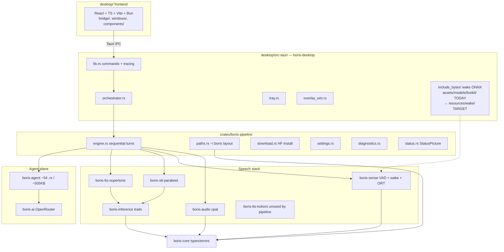
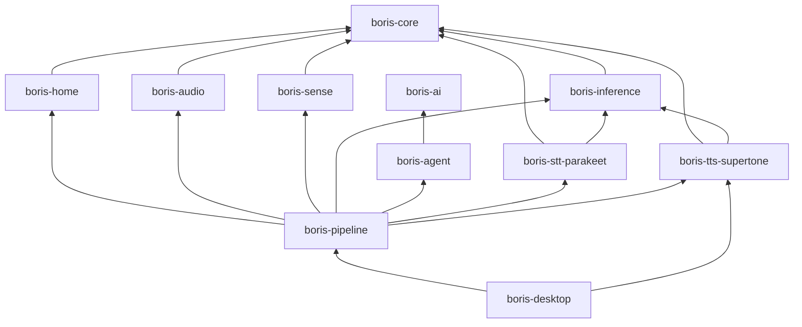
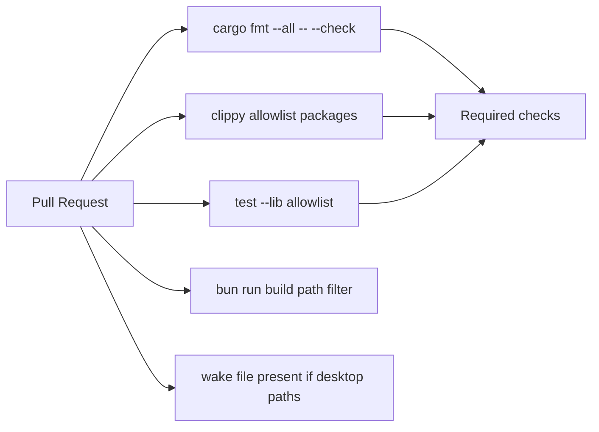
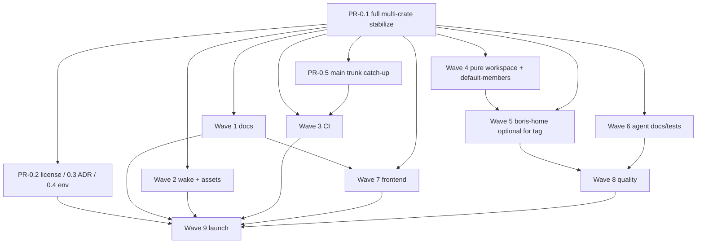

# Boris Assistant: Deep Repository Refactor for Open-Source Collaboration

| Field | Value |
|-------|--------|
| **Document** | Repository architecture & collaboration refactor |
| **Author** | Architecture / design (AI-assisted draft) |
| **Date** | 2026-08-08 |
| **Status** | Draft (revised after design review) |
| **Repo root** | `C:\Users\uttam\Desktop\Programming\RUST\boris-assistant` |
| **Remote** | https://github.com/blocksdevpro/boris-assistant.git |
| **Primary branch today** | Local day-to-day: `boris-desktop` (~3 commits ahead of `main` + large dirty WIP); remote default: `main` |
| **Product entrypoint** | Tauri desktop (`desktop/src-tauri` → `boris-desktop`) |

---

## Overview

Boris is a Windows-first desktop voice assistant built as a Cargo workspace of speech, agent, and Tauri host crates, plus a React/Vite frontend. The product works, but the repository is hard for a solo maintainer—and nearly impossible for outside contributors—because:

- There is **no root README, LICENSE, CONTRIBUTING, CI, or architecture map**.
- **~1.2–1.3GB of models** and **unrelated monorepo dumps** (`assets/tau` ~3MB, `assets/grok-build` ~64MB) sit beside real source while `.gitignore` ignores `/assets` (local-only clutter that still confuses anyone who clones and explores disk).
- **`boris-agent` is a ~505KB / ~54-file mega-crate** with active WIP (tools, concurrency, listing, progress, `tool_search`). The **dirty working tree is multi-crate**, not agent-only: pipeline (`paths`/`settings`/`engine`/…) and desktop bridge/host are dirty too (~47 paths, ~+2355/−584 lines).
- Crate boundaries are uneven: `boris-inference` is a thin trait shell; pipeline owns home/settings/download that any host needs; root `boris-assistant` binary is a retired stub.
- **Fresh clones cannot compile `boris-desktop`**: wake is `include_bytes!` from gitignored `assets/models/livekit/`. Onboarding is Windows/ORT/DirectML-heavy with no feature matrix for partial builds.

This design proposes an **incremental, PR-sized refactor** that:

1. **Stabilizes the full dirty tree** (agent + pipeline + desktop), then makes **`main` the day-to-day trunk**.
2. Establishes OSS hygiene and discoverability (docs, license, CI, CODEOWNERS).
3. Separates **product source**, **reference material**, and **runtime models**; commits the small wake ONNX so clones build.
4. Clarifies the **crate DAG** (including optional later `boris-home` extract) without rewriting the agent loop.
5. Modularizes `boris-agent` *in place* (module map + conventions; optional crate split only with owner ADR).
6. Sequences cleanup so multi-crate WIP is not destroyed; parallel work uses **per-PR file manifests**, not coarse path monopolies.

Implementation is **out of scope for this document**; the final section is a wave-based PR plan suitable for parallel subagents and worktrees.

---

## Background & Motivation

### Current architecture (verified)



**Workspace members** (`Cargo.toml` — explicit list today):

| Member | Role | Approx. size |
|--------|------|--------------|
| `crates/boris-core` | Shared types, errors, `AUDIO_TARGET_RATE` | 4 files, ~4KB |
| `crates/boris-audio` | cpal I/O, resampler, service | 6 files, ~46KB |
| `crates/boris-sense` | WebRTC VAD, LiveKit wakeword (git dep), ORT init | 8 files, ~8KB |
| `crates/boris-inference` | `SpeechToText` / `TextToSpeech` traits only | 1 file, ~0.7KB |
| `crates/boris-ai` | `LlmClient`, OpenRouter, streaming | 6 files, ~28KB |
| `crates/boris-agent` | Loop, tools (~18), runtime, memory, session, skills | ~54 files, ~505KB |
| `crates/boris-stt-parakeet` | Parakeet STT adapter | 1 file |
| `crates/boris-tts-supertone` | Supertone TTS (default product) | 1 file |
| `crates/boris-tts-kokoro` | Kokoro TTS (workspace member; **not wired** into pipeline features) | 1 file |
| `crates/boris-pipeline` | Desktop voice engine, paths, download, settings, diagnostics | 11 files, ~180KB |
| `desktop/src-tauri` | Tauri v2 host | 5 Rust files, ~34KB |

**Root package** `boris-assistant` (`src/main.rs`): retired stub that prints “use desktop” and exits 1. Still a package at workspace root — so bare `cargo build` / `cargo run` targets that stub, not the product.

**Frontend** (`desktop/`): React 19, TS, Vite, Bun, Tailwind 4, shadcn; bridge contracts in `desktop/src/bridge/types.ts` mirror `StatusPicture` / model install DTOs; windows under `windows/main` and `windows/overlay`.

**User data** (already well-designed in `boris-pipeline::paths`): `~/.boris` with `config.toml`, `auth.json`, sessions, memory, skills, logs/audit, models, `state/workspace`. Dev bootstrap copies from workspace `assets/models` when present (`bootstrap_models_if_needed` / `find_dev_assets_models`). Product **runtime** install path: `install_models` + Hugging Face (override `BORIS_MODEL_BASE_URL`). Engine uses `ParakeetStt::with_model_dir` / `SupertoneTts::with_paths` against `~/.boris`. LiveKit wake is **embedded** at **compile time** via `include_bytes!` (not downloaded).

**Compile vs runtime (critical distinction):**

| Concern | Today | After Wave 2 |
|---------|-------|----------------|
| **Compile** `boris-desktop` | Requires untracked `assets/models/livekit/boris-large.onnx` (~3.77 MB) | Requires tracked `desktop/src-tauri/resources/wake/boris-large.onnx` |
| **Runtime** STT/TTS | `~/.boris/models` via download/bootstrap | Unchanged — download-primary |
| Legacy adapter `::new()` | Still hardcodes `./assets/models/...` in parakeet, supertone, kokoro | Mark deprecated; product paths use `~/.boris` constructors |

**Branch topology (measured):**

- `origin/main` is GitHub default and already receives feature merges (e.g. `#15` agent-tool-runtime).
- Local `boris-desktop` is only **~3 commits ahead** of `main` (audio TTS fix, openrouter routing, agent silent-turn fix); merge-base ≈ main tip.
- Pain is **not** a huge long-lived branch delta — it is **~47 dirty paths** spanning agent + pipeline + desktop, plus dual-trunk confusion (day-to-day on `boris-desktop` while remote default is `main`).

**Active multi-crate WIP (do not thrash) — forbidden for structural moves until PR-0.1 lands:**

| Area | Dirty examples |
|------|----------------|
| `crates/boris-agent/**` | Most sources; untracked `runtime/{concurrency,listing,progress}.rs`, `tools/tool_search.rs`, scripts |
| `crates/boris-pipeline/**` | `Cargo.toml`, `config.rs`, `engine.rs`, `lib.rs`, **`paths.rs`**, **`settings.rs`** |
| Desktop host + bridge | `desktop/src-tauri/src/lib.rs`, `desktop/src/bridge/{status,types}.ts`, `MainWindow.tsx` |
| Lockfile | `Cargo.lock` |

Local feature branches also exist: `feat/agent-harness-p0`, `feat/agent-sessions-p1`, `feat/agent-tool-runtime`, `feat/agent-tools-p2`, `feat/personal-context`, `feat/desktop-ship-readiness`, `frontend-design`.

### Pain points (mapped to facts)

1. **Discoverability** — no root docs; only `desktop/README.md` (logs + ORT packaging).
2. **Scatter** — product code, reference trees under `assets/`, and multi-GB models share one mental folder.
3. **OSS unfriendliness** — models ignored by git but present on disk; tau/grok-build dumps; no LICENSE; **fresh clone cannot build desktop** (wake outside git).
4. **Dead surface** — root binary package still named like the product; bare `cargo build` misleading.
5. **Missing hygiene** — no `.github/`, CODEOWNERS, issue/PR templates, AGENTS.md.
6. **Fuzzy crates** — thin `boris-inference`; agent mega-crate; pipeline = engine + data plane.
7. **Platform onboarding** — Windows ORT/DirectML packaging only in desktop README; no optional “agent-only” / “UI-only” paths.
8. **Testing** — unit tests in several crates + `tests/tool_live_smoke.rs`; no CI; live smoke not for default CI.
9. **Collaboration** — dual-trunk (`main` vs `boris-desktop`); no ownership map.
10. **In-progress risk** — structural refactors (esp. path moves, platform extract, bridge DTOs) fight **multi-crate** dirty work.

---

## Goals & Non-Goals

### Goals

- Make the repo **clone → build → contribute** clear for humans and AI agents (including `cargo check -p boris-desktop` without local `/assets`).
- Establish a **stable top-level layout** and documentation system.
- Keep **desktop as the sole product entrypoint**.
- Preserve **model install/download** for end users; keep local bootstrap optional/deprecated for runtime seeds.
- Modularize agent code for **navigation and parallel ownership** without a greenfield rewrite.
- Ship work as **ordered, independently reviewable PRs** with explicit parallelization and **per-PR file manifests**.
- Leave Windows as primary; structure optional features for future macOS/Linux.

### Non-Goals

- Rewriting the ReAct loop, tool suite, or OpenRouter client from scratch.
- Full macOS/Linux product parity in this refactor.
- Committing multi-GB STT/TTS models to git or Git LFS as the primary distribution path.
- Merging `assets/tau` or `assets/grok-build` into the product runtime.
- Big-bang monorepo → polyrepo split of all crates.
- Changing product UX/features except where structure forces thin adapters.
- **Required** platform extract for public launch (see Alternative 7 — Wave 5 is in-scope for long-term health but demotable post-launch if owner prioritizes speed).

---

## Key Decisions

| # | Decision | Rationale |
|---|----------|-----------|
| K1 | **Trunk = `main`; retire day-to-day use of `boris-desktop` after catch-up** | Remote default is already `main` and receives merges. Local `boris-desktop` is only ~3 commits ahead; dual-trunk confuses contributors. After PR-0.1 + PR-0.5, day-to-day work is on `main`; delete remote `boris-desktop` once branch protection/CI sit on `main`. |
| K2 | **Multi-area WIP freeze before structural moves** | Dirty tree spans **agent + pipeline + desktop bridge/host**, not agent alone. Land/park **all** of it (PR-0.1) before path moves, platform extract, wake-only if it conflicts with dirty host files, or agent crate splits. **Docs / license / most CI** may start after 0.1 is committed on a clean tip (or on files that do not overlap dirty paths). **Forbidden until freeze clears:** T-platform, PR-2.4 code edits to `paths.rs`, Wave 5, Wave 6 structural renames, and concurrent edits to dirty bridge DTOs. |
| K3 | **Models: download-first at runtime; never commit STT/TTS weights** | `download.rs` + HF already exist; `~/.boris/models` is the runtime store. Separate from compile-time wake embed (K15). |
| K4 | **Remove `assets/tau` and `assets/grok-build` from the tree** | Reference dumps (~64MB + ~3MB), not build deps. Replace with `docs/prior-art.md` links. No default submodules. |
| K5 | **Keep `boris-inference` as trait crate** | Decouples adapters from perception. Do not merge into core until a second host needs different traits. |
| K6 | **Name the data-plane crate `boris-home`** (not `boris-platform`) | Matches `~/.boris` / `BORIS_HOME` mental model; shorter; avoids “platform” vs OS-platform confusion. Extract paths + settings + download (+ readiness/preflight living in paths today). **`diagnostics.rs` stays in pipeline** initially but updates imports to `crate::paths` / re-exported modules; optional later move if it becomes pure home logging. Wave 5 is **post-stabilize** and **optional for first public tag** (Alternative 7). |
| K7 | **Modularize `boris-agent` via modules + docs first** | Avoid premature multi-crate thrash. Optional `boris-agent-tools` only with **owner-approved ADR** (PR-6.5 / Wave 9+). AGENTS.md: do not open agent crate-split PRs without ADR. |
| K8 | **Retire root package; pure workspace with explicit `default-members`** | Root stub confuses identity. After removal, bare `cargo build` must **not** build all members (desktop/ORT). See K16. |
| K9 | **License: Apache-2.0 preferred; owner must confirm** | Required for external contrib. LICENSE in Wave 0. CI/CODEOWNERS may land in parallel once LICENSE PR is open or merged; do not block technical CI on legal bikeshed beyond a short owner window. |
| K10 | **CI lite package allowlist (ubuntu)** | Concrete commands in §G / PR-3.1 — **not** full workspace clippy until sense/ORT feature-gated. `tool_live_smoke` excluded (`--lib` only). |
| K11 | **Wake: keep compile-time embed** | Avoid first-run download race for always-on wake. |
| K12 | **Frontend stays under `desktop/`; bridge is the contract** | UI-only path via `desktop/src` + typed `bridge/`. |
| K13 | **CODEOWNERS by crate/area** | Mental ownership map even for solo owner. |
| K14 | **Pipeline features: `stt-parakeet` + `tts-supertone` default; kokoro experimental** | Kokoro unused by pipeline; document or demote. |
| K15 | **Commit wake ONNX (~3.77 MB) under `desktop/src-tauri/resources/wake/`** | Measured size is fine without LFS. Fresh clone must `cargo check -p boris-desktop`. Binary budget: fail PR/CI if wake resource missing; revisit LFS only if file grows dramatically. |
| K16 | **`default-members` = CI-lite crates** | After pure workspace: `default-members = ["crates/boris-core", "crates/boris-ai", "crates/boris-agent"]` so bare `cargo build` / `cargo test` match CI lite. Product: always `cargo build -p boris-desktop` / Tauri scripts. Document in README. |
| K17 | **Day-to-day branch is `main` after stabilize + catch-up** | PR-0.1 lands WIP; PR-0.5 merges product tip to `main`; protect `main`; stop committing on `boris-desktop`. |

---

## Proposed Design

### A. Target repository architecture

Ideal top-level layout **after** full migration:

```text
boris-assistant/
├── README.md
├── LICENSE
├── SECURITY.md
├── CODE_OF_CONDUCT.md
├── CONTRIBUTING.md
├── AGENTS.md
├── CHANGELOG.md
├── rust-toolchain.toml
├── rustfmt.toml
├── clippy.toml                 # optional
├── deny.toml                   # optional
├── .env.example
├── .gitignore
├── Cargo.toml                  # workspace-only + default-members
├── Cargo.lock
├── crates/
│   ├── boris-core/
│   ├── boris-home/             # NEW (Wave 5, optional post-launch): paths, settings, download
│   ├── boris-audio/
│   ├── boris-sense/
│   ├── boris-inference/
│   ├── boris-ai/
│   ├── boris-agent/
│   ├── boris-stt-parakeet/
│   ├── boris-tts-supertone/
│   ├── boris-tts-kokoro/       # experimental
│   └── boris-pipeline/         # voice engine (+ diagnostics); data plane re-exported until extract
├── desktop/
│   ├── README.md
│   ├── package.json
│   ├── src/
│   └── src-tauri/
│       ├── resources/ort/      # staged DLLs (Windows); may stay mostly untracked
│       └── resources/wake/     # TRACKED boris-large.onnx (~3.77MB)
├── docs/
│   ├── architecture.md
│   ├── crate-map.md
│   ├── data-layout.md
│   ├── models.md               # compile-time wake vs runtime STT/TTS
│   ├── platform-windows.md
│   ├── platform-macos.md
│   ├── platform-linux.md
│   ├── agent-module-map.md
│   ├── contributing-ui.md
│   ├── prior-art.md
│   ├── release-smoke-windows.md
│   ├── adr/
│   │   ├── 0001-trunk-based.md
│   │   └── 0002-boris-home.md  # when Wave 5 runs
│   └── diagrams/
├── scripts/
│   ├── bootstrap-dev.ps1
│   ├── bootstrap-dev.sh
│   ├── check.ps1               # matches CI lite
│   ├── check.sh
│   └── cleanup-local-assets.ps1
├── .github/
│   ├── CODEOWNERS
│   ├── pull_request_template.md
│   ├── ISSUE_TEMPLATE/
│   └── workflows/
│       ├── ci.yml
│       └── frontend.yml
└── xtask/                      # optional
```

**What is explicitly *not* in the tree:**

| Path today | Disposition |
|------------|-------------|
| `assets/models/**` (~1.2–1.3GB STT/TTS) | Not in git. Runtime: `~/.boris/models`. |
| Wake ONNX | **In git** at `desktop/src-tauri/resources/wake/` (K15). |
| `assets/tau`, `assets/grok-build` | Delete from expectations; prior-art docs only. |
| Root `src/main.rs` | Remove with pure workspace. |
| `target/`, `node_modules/`, `dist/` | Gitignored. |

**`.gitignore` target (conceptual):**

```gitignore
/target
.env
.env.*
!.env.example
/assets/
desktop/node_modules/
desktop/dist/
.DS_Store
Thumbs.db
.idea/
.vscode/*
!.vscode/extensions.json
```

Wake lives under `desktop/src-tauri/resources/wake/` and is **not** covered by `/assets/` ignore.

### B. Crate boundary redesign

#### Target dependency DAG (after Wave 5)



**Rules:**

- No cycles.
- `boris-agent` must **not** depend on `boris-pipeline` or `boris-home` (paths via `BuiltinToolPaths` / host injection).
- `boris-ai` free of audio/speech.
- Speech adapters depend only on `core` + `inference`.

#### Crate disposition

| Crate | Action | Notes |
|-------|--------|-------|
| `boris-core` | **Keep** | Shared types only. |
| `boris-home` | **Add in Wave 5** (name fixed by K6) | `paths`, `settings`, `download` modules; preflight/readiness live inside `paths` today — move as one module, not a separate file. Deps: `tracing` + `serde` (5.1); + `toml` + blocking `reqwest` (5.2). See PR-5.1 Cargo.toml sketch. |
| `boris-audio` / `boris-sense` | **Keep** | Future optional `wake` feature for CI — not Wave 0–3. |
| `boris-inference` | **Keep thin** | |
| `boris-ai` | **Keep** | |
| `boris-agent` | **Keep + modularize** | Docs/conventions; no split without ADR. |
| STT/TTS crates | **Keep** | Deprecate legacy `./assets/models` `::new()` paths (PR-2.5). |
| `boris-pipeline` | **Slim over time** | Engine, hear, status, devices, prompt, diagnostics, engine config. Re-exports `boris_home::{paths,settings,download}` modules. |
| `boris-desktop` | **Keep** | Thin host; wake under resources. |
| Root `boris-assistant` | **Remove** | Pure workspace + K16 `default-members`. |

#### Feature flags

| Feature path | Default | Purpose |
|--------------|---------|---------|
| `boris-pipeline/stt-parakeet` | on | Product STT |
| `boris-pipeline/tts-supertone` | on | Product TTS |
| Future `tts-kokoro` | off | Experimental |
| Future `boris-sense/wake` | on for desktop | Allow CI without ORT later |

Contributor profiles:

- **UI-only:** `cd desktop && bun install && bun run dev` (mock bridge optional Wave 7).
- **Agent-only:** `cargo test -p boris-core -p boris-ai -p boris-agent --lib`
- **Full desktop (Windows):** Tauri + ORT DLL staging.

### C. Agent modularization

Current module surface (`boris-agent/src/lib.rs`) — verified:

| Layer | Modules | Responsibility |
|-------|---------|----------------|
| Loop | `loop_`, `finish_gate`, `types` | Pure ReAct; parallel-safe batches |
| Facade | `agent`, `outcome`, `observe`, `stats` | Stateful host API |
| Runtime | `runtime/{policy,timeout,audit,pending,concurrency,listing,progress}` | Tool execution plane |
| Tools | `tools/*` (incl. `tool_search`), `tool`, `tool_context`, `capability` | Observation-only tools |
| Memory | `memory/*` | Profile + long-term |
| Session | `session/*` | Store + transcript |
| Skills | `skills` | Playbooks |
| Routing | `routing`, `prompt_profile`, `reminder`, `client` | Prompt/routing helpers |

Agent depends on **`boris-ai` only** (not pipeline). Host injects `BuiltinToolPaths`.

**Near-term:** docs + conventions; stable `lib.rs` re-exports; remove `AgentEngine` alias when grep-clean (PR-6.3 — alias only in `lib.rs` today).

**PR-6.2 / tools freeze:** comments-only on `tools/mod.rs` is **rebase-only after tools feature freeze** — not concurrent with tool implementation PRs.

**Optional crate split (`boris-agent-tools`):** **owner-approved only**, Wave 9+, requires ADR. Playbook forbids eager subagents from starting it.

```mermaid
sequenceDiagram
  participant Host as boris-pipeline / desktop
  participant Agent as Agent facade
  participant Loop as agent_loop
  participant RT as ToolRuntime
  participant Tool as dyn Tool

  Host->>Agent: prompt(user_text)
  Agent->>Loop: complete + tool calls
  Loop->>RT: invoke batch (policy, timeout, audit)
  RT->>Tool: call(ctx, args)
  Tool-->>RT: observation string
  RT-->>Loop: tool results
  Loop-->>Agent: AgentOutcome
  Agent-->>Host: Speak / Confirm / Done
```

### D. Desktop / frontend structure

```text
desktop/
├── src/
│   ├── bridge/          # IPC contract — pair with Rust DTOs as atomic PR
│   ├── components/
│   ├── windows/main/
│   ├── windows/overlay/
│   ├── lib/
│   └── App.tsx
└── src-tauri/
    ├── src/{lib,orchestrator,tray,overlay_win,main}.rs
    ├── resources/ort/
    └── resources/wake/  # TRACKED wake ONNX
```

**Bridge DTO rule:** changes to `desktop/src/bridge/types.ts` (or `status.ts`) **and** Rust DTO sources (`status.rs`, download DTOs, etc.) ship in **one atomic PR**. No parallel agents on either side while the other is open.

**Frontend freeze while WIP dirty:** until PR-0.1 lands, T-frontend must not race the dirty `bridge/*` and `MainWindow.tsx` — either include those files in 0.1 or wait.

Host stays thin: lifecycle, status mirror, commands — no voice policy.

### E. Assets & models strategy

| Asset class | Strategy |
|-------------|----------|
| Parakeet / Supertone weights | HTTP → `~/.boris/models`; HF + `BORIS_MODEL_BASE_URL`; optional `HF_TOKEN` |
| LiveKit wake ONNX | **Commit** ~3.77 MB at `resources/wake/`; `include_bytes!("../resources/wake/boris-large.onnx")` from `orchestrator.rs` |
| Kokoro / legacy `::new()` | Deprecate hardcoded `./assets/models/...` in **parakeet, supertone, and kokoro** (not kokoro-only) |
| Dev seed `bootstrap_models_if_needed` | Optional power-user path; document as non-required after download-primary messaging; **does not fix compile** — only PR-2.1 does |
| `assets/tau`, `assets/grok-build` | Remove from tree expectations |
| Git LFS | Not for multi-GB models; wake does not need LFS at 3.77 MB |
| Binary budget | PR-2.1 / CI: fail if `resources/wake/boris-large.onnx` missing |

**PR-2.1 acceptance:** clean tree **without** `/assets` still passes `cargo check -p boris-desktop` (Windows toolchain).

### F. Documentation system

| Doc | Content |
|-----|---------|
| `README.md` | Product, Windows quick start, `default-members` note, models, clone-builds-desktop after Wave 2 |
| `CONTRIBUTING.md` | Branching on `main`, PR size, checks, solo squash map pointer |
| `AGENTS.md` | Repo map, per-area rules, **no agent crate-split without ADR**, multi-crate freeze rules, CI lite commands |
| `SECURITY.md` | Vuln report; secrets; note CSP follow-up |
| `docs/models.md` | **Compile-time wake** vs **runtime STT/TTS** |
| `docs/agent-module-map.md` | Module ownership |
| `docs/prior-art.md` | tau / Grok Build without vendoring |
| `docs/adr/*` | Trunk, boris-home, optional agent-tools |
| Per-crate README | Purpose, features, deps |

### G. CI/CD & quality gates



**PR-3.1 concrete allowlist (ubuntu-latest) — lock this:**

```bash
cargo fmt --all -- --check
cargo clippy -p boris-core -p boris-ai -p boris-agent --all-targets -- -D warnings
cargo test -p boris-core -p boris-ai -p boris-agent --lib
```

Explicit non-goals for default CI:

- **Not** workspace-wide clippy (sense → `ort` + git `livekit-wakeword`; pipeline → cpal/STT/TTS).
- **Not** `tool_live_smoke` (integration; needs live env) — only `--lib`.
- **Not** full `boris-desktop` / Tauri on ubuntu (Windows-first; optional later `desktop-windows` job).
- Jobs that eventually build sense/pipeline need network for **git dependencies** (`actions/checkout` + cargo git fetch).

**Frontend job (path-filtered):** Bun + `bun run build` on `desktop/**`.

**Wake presence (Wave 2+):** on PRs touching `desktop/src-tauri/**`, assert `resources/wake/boris-large.onnx` exists (simple CI step or script).

**Pre-commit:** optional; document `scripts/check.ps1` / `check.sh` matching CI lite.

**cargo-deny / audit:** later.

### H. Collaboration model

**Branching:** trunk-based on `main` after PR-0.5.

- Short-lived: `feat/<area>-<short>`, `fix/…`, `docs/…`, `chore/…`.
- Delete after merge.
- **Do not** reopen long-lived `boris-desktop` as product trunk.

**PR norms:** S/M/L as before. Solo maintainers may squash an entire wave’s docs PRs into 1–2 PRs (see solo map under PR Plan).

**CODEOWNERS:** by crate/area.

**Labels:** `area/agent`, `area/pipeline`, `area/desktop-ui`, `area/desktop-host`, `area/speech`, `area/docs`, `area/ci`, `good first issue`, `needs-windows`, `epic/refactor`.

**Good-first-issue examples:** per-crate READMEs, `.env.example` polish, pure unit tests, frontend-only polish.

### I. Migration / rollout

**Principles:** desktop keeps running on Windows after each merged wave; clean multi-crate WIP first; structural path moves only on clean `paths.rs` / `settings.rs`.

| Wave | Theme | Break risk | Parallelism | DoD (commands) |
|------|-------|------------|-------------|----------------|
| 0 | Stabilize full dirty tree → `main` trunk; license; env hygiene | None if compile green | 0.1 then 0.5 sequential; 0.2–0.4 parallel after tip known | `cargo check -p boris-agent -p boris-pipeline -p boris-desktop` (Windows); clean `git status` |
| 1 | Docs (file-manifest parallel) | None | High (per-PR files) | Markdown only; links resolve |
| 2 | Wake embed + gitignore + legacy deprecations | Low–med (host compile) | 2.1 exclusive on orchestrator/wake; then parallel | **Without `/assets`:** `cargo check -p boris-desktop` |
| 3 | CI + templates + toolchain | None | High | CI green on allowlist |
| 4 | Pure workspace + default-members | Low | Parallel with 1–3 **after 0.1 clean**; serialize root `Cargo.toml` | `cargo build` builds only default-members; `cargo build -p boris-desktop` works |
| 5 | `boris-home` extract (optional for first public tag) | Medium | Sequential; clean paths/settings | `cargo test -p boris-pipeline --lib`; `cargo check -p boris-desktop`; zero pipeline call-site edits beyond `lib.rs`+toml |
| 6 | Agent docs/tests (post-stabilize) | Low | High within non-tools files | `cargo test -p boris-agent --lib` |
| 7 | Frontend contrib | Low | After bridge clean | `bun run build` |
| 8 | Quality / speech notes / optional checksums | Low | High | scripts/check matches CI |
| 9 | Launch polish; owner-only agent-tools ADR | Low | High | Smoke checklist |

**Feature flags / shims:** module re-exports during Wave 5 (see API section).

**Rollback:** docs/CI independent reverts; platform extract only if module shims complete (Issue 2 recipe).

**Risk register:**

| Risk | Severity | Mitigation |
|------|----------|------------|
| Multi-crate dirty WIP collision | **Critical** | K2 / PR-0.1 full freeze; ban T-platform until clean |
| Incomplete re-exports break `crate::paths` | **Critical** | Module-level `pub use boris_home::paths;` |
| Wake path / missing file | High | K15 + CI presence check |
| Bare `cargo build` builds all members | High | K16 default-members |
| CI red (ORT/arboard/sense) | Medium | Allowlist packages only |
| Contributors dual-trunk | Medium | K1/K17 + PR-0.5 early |
| License delay | Medium | Parallel CI once LICENSE open; owner window |

---

## API / Interface Changes

### Host-facing (minimize churn)

Keep stable:

- `boris_pipeline::{Engine, EngineHandle, EngineCommand, StatusPicture, …}`
- Tauri command names used by `desktop/src/bridge`
- `boris_agent::{Agent, AgentOutcome, builtin_tools, …}`
- `install_models` / `models_status` / `BORIS_MODEL_BASE_URL_ENV` (via pipeline re-exports after extract)

### Planned compatibility shims (Wave 5) — **module** re-exports

Pipeline internals use **module paths**, not only crate-root items:

- `engine.rs`: `use crate::paths;`
- `config.rs`: `use crate::paths;` / `use crate::settings::{...}`
- `download.rs` / `diagnostics.rs` / `settings.rs`: `use crate::paths::{...}` or `paths::{self, ...}`
- Desktop: `boris_pipeline::{ paths, ... }` and `paths::preflight()`

**Compile-preserving pattern (required):**

```rust
// crates/boris-pipeline/src/lib.rs after move — temporary shims
// Module aliases so `crate::paths`, `crate::settings`, `crate::download` keep working
// inside pipeline without editing engine/config/diagnostics call sites:
pub use boris_home::paths;
pub use boris_home::download;
pub use boris_home::settings;

// Flat re-exports for existing `boris_pipeline::install_models` / prelude style:
pub use boris_home::download::{
    install_models, models_status, DownloadFileStatus, DownloadProgress, ModelComponent,
    ModelsInstallReport, ModelsStatus, BORIS_MODEL_BASE_URL_ENV,
};
pub use boris_home::paths::{
    auth_path, boris_home, config_path, ensure_logs_dir, ensure_sessions_dir, logs_dir,
    memory_dir, migrate_home_if_needed, models_dir, notes_path, preflight, profile_path,
    sessions_dir, sessions_root, workspace_dir, PreflightReport, BORIS_HOME_ENV, DESKTOP_WORKSPACE,
};
pub use boris_home::settings::{load_settings, save_settings, secrets_path, settings_path, AppSettings};
```

**Anti-pattern (broken):** `pub use boris_home::paths::*;` alone — re-exports **items** at crate root but does **not** create `boris_pipeline::paths` as a module; breaks `use crate::paths` and `boris_pipeline::paths::…`.

### `boris-home` crate dependency sketch (match pipeline / workspace)

Verified needs from current modules (`paths` / `settings` / `download` in `boris-pipeline`):

| Module | Needs |
|--------|--------|
| `paths.rs` (PR-5.1) | `serde` (derive), `tracing` |
| `settings.rs` (PR-5.2) | `serde`, `toml`, `tracing`, `paths` |
| `download.rs` (PR-5.2) | `serde`, `reqwest` (blocking + json), `tracing`, `paths` |

**PR-5.1** — `crates/boris-home/Cargo.toml` (paths only):

```toml
[package]
name    = "boris-home"
version = "0.1.0"
edition = "2021"
description = "Boris user-data plane: ~/.boris paths, settings, model download"

[dependencies]
# Match root workspace / pipeline versions — prefer workspace = true where available.
tracing = { workspace = true }
serde   = { version = "1", features = ["derive"] }
```

Also add to root workspace (same PR):

```toml
# Cargo.toml [workspace.dependencies]
boris-home = { path = "crates/boris-home" }
```

Pipeline after 5.1:

```toml
# crates/boris-pipeline/Cargo.toml
boris-home = { workspace = true }
# keep serde/tracing as needed for remaining modules; paths dep moves to boris-home
```

**PR-5.2** — extend `boris-home` deps when settings + download move (versions match current pipeline `Cargo.toml`):

```toml
[dependencies]
tracing    = { workspace = true }
serde      = { version = "1", features = ["derive"] }
serde_json = { workspace = true }  # only if a moved module needs it; settings/download primarily use serde + toml
toml       = "0.8"
reqwest    = { version = "0.13", default-features = true, features = ["blocking", "json"] }
```

**Do not** pull `boris-audio`, `boris-sense`, `boris-agent`, `tokio` multi-thread runtime, or STT/TTS into `boris-home`. After extract, pipeline may drop `toml` / blocking `reqwest` if no remaining local uses (audit in PR-5.2).

**PR-5.1 acceptance criteria:**

1. New crate `boris-home` on workspace members (explicit list **or** `crates/*` glob adopted in same PR — today members are explicit; **must add** `crates/boris-home`).
2. Mechanical move of modules + their `#[cfg(test)]` blocks; Cargo.toml deps as sketched above.
3. Pipeline `lib.rs` uses **module** re-exports above; remove `mod paths;` etc.
4. **`diagnostics.rs` keeps `use crate::paths::{...}`** — zero edit required if module re-export present (or only import-path tweak if something was `mod`-private).
5. `config.rs` / `engine.rs` call sites unchanged.
6. Gates: `cargo test -p boris-pipeline --lib` and `cargo check -p boris-desktop` pass with **zero** intentional call-site edits inside pipeline modules beyond `lib.rs` + `Cargo.toml` + new crate.

**Do not** combine SHA256 checksum work with extract (freeze `download.rs` writers during Wave 5).

### Root package (Wave 4)

**Before:** workspace root is also package `boris-assistant` with retired bin.

**After:**

```toml
[workspace]
resolver = "2"
members = [
    "crates/boris-core",
    "crates/boris-audio",
    "crates/boris-sense",
    "crates/boris-inference",
    "crates/boris-ai",
    "crates/boris-agent",
    "crates/boris-stt-parakeet",
    "crates/boris-tts-kokoro",
    "crates/boris-tts-supertone",
    "crates/boris-pipeline",
    # "crates/boris-home",  # Wave 5
    "desktop/src-tauri",
]
# Prefer explicit list OR switch to crates/* in the same PR that adds boris-home.
default-members = [
    "crates/boris-core",
    "crates/boris-ai",
    "crates/boris-agent",
]

# no [package] at root
```

Checklist: `cargo metadata` succeeds; bare `cargo build` does **not** force full Tauri/ORT; `cargo build -p boris-desktop` still works; README documents defaults; any “`cargo run` at root” docs removed/replaced with desktop instructions.

### Wake embed path

**Before:** `include_bytes!("../../../assets/models/livekit/boris-large.onnx")`  
**After:** `include_bytes!("../resources/wake/boris-large.onnx")` (from `orchestrator.rs`)

---

## Data Model Changes

**No change** to `~/.boris` layout semantics — migration helpers stay.

Document in `docs/data-layout.md`.

**Secrets:** `.env` gitignored; `auth.json` under home; **redact API keys** in any new `tracing` around settings load (do not log full keys on start).

---

## Alternatives Considered

### 1. Big-bang monorepo rewrite (single mega-PR)

- **Pros:** Clean history in one shot.  
- **Cons:** Unreviewable; destroys multi-crate WIP; high regression risk.  
- **Rejected.**

### 2. Split every agent folder into its own crate immediately

- **Pros:** Hard boundaries.  
- **Cons:** API explosion; fights WIP; overkill for ~505KB crate.  
- **Deferred** (owner ADR only).

### 3. Git LFS for models in-repo

- **Pros:** One clone has weights.  
- **Cons:** Multi-GB clones; poor OSS UX.  
- **Rejected** for STT/TTS. Wake at 3.77 MB uses normal git (K15).

### 4. Keep `assets/tau` / `assets/grok-build` as submodules

- **Pros:** Local reference.  
- **Cons:** Submodule footguns; tree noise.  
- **Rejected** for docs links.

### 5. Merge `boris-inference` into `boris-core`

- **Pros:** One fewer crate.  
- **Cons:** Core becomes speech-opinionated.  
- **Rejected.**

### 6. Multi-repo split

- **Pros:** Independent versioning.  
- **Cons:** Premature for team size.  
- **Rejected.**

### 7. OSS hygiene only — defer `boris-home` extract indefinitely

- **Scope:** Waves 0–3 + wake path (2.1) + retire root stub (4.1) + license/docs/CI; **no** Wave 5 crate split.
- **Pros:** Faster path to “clone → build → contribute”; fewer merge conflicts with pipeline; enough for public launch.
- **Cons:** Pipeline remains mixed engine + data plane; harder multi-host reuse later; paths still live next to voice engine.
- **Decision for this design:** Keep Wave 5 **in-scope for long-term collaboration health**, but mark it **optional for first public tag**. Owner may ship a public v0.1 after Waves 0–4 + 2.1 without waiting on `boris-home`. If schedule slips, demote Wave 5 post-launch rather than blocking README/CI/wake.

---

## Security & Privacy Considerations

| Threat / concern | Mitigation |
|------------------|------------|
| API keys in git | `.env` ignored; SECURITY.md; GitHub secret scanning |
| Key leakage in logs | Redact secrets in settings/load tracing; review start logs |
| Tool execution | SandboxConfig, ShellPolicy, NetworkPolicy, HITL — document threat model |
| Model supply chain | HTTPS HF; optional checksum PR **after** extract freeze (not same PR) |
| ORT DLLs | Ship known DLLs; document staging |
| **CSP** | `tauri.conf.json` has `"csp": null` today — **follow-up hardening**, not blocking OSS refactor |
| Wake binary growth | Presence check in CI; size review if file changes |
| No telemetry | Keep local-only personal memory |

Privacy: profile/MEMORY/notes stay under `~/.boris`.

---

## Observability

**Existing:** `~/.boris/logs`, DEBUG defaults for `boris_*` in packaged builds, pipeline diagnostics, agent audit JSONL.

**Additions:**

- Document logs + `RUST_LOG` / `BORIS_LOG` in root README.
- Preserve diagnostics behavior when re-exporting paths.
- Wake resource missing → fail check early (build or CI).
- Platform extract rollback depends on complete module shims.

**Metrics/alerting:** GitHub Actions failures only for OSS phase.

---

## Rollout Plan

1. **PR-0.1** commit/park **full** dirty tree (agent + pipeline + desktop).
2. **PR-0.5** catch-up merge to **`main`**; set day-to-day trunk (K17).
3. Owner confirms **license (K9)** quickly (PR-0.2).
4. Waves 1–3 + Wave 4 pure workspace **in parallel** on clean `main` (respect file manifests / T-workspace lock).
5. **PR-2.1** wake commit — unblocks true clone→build for desktop.
6. Wave 5 `boris-home` when paths/settings clean and optional schedule allows.
7. Wave 6 only after agent stabilize (satisfied by 0.1).
8. Tag public release when README + LICENSE + CI lite + wake path solid (Wave 5 optional per Alt 7).

---

## Open Questions

1. **License:** Apache-2.0 vs MIT vs dual? *(Owner — K9; blocks polished public marketing, not technical Waves 1–4.)*
2. **Public API stability outside this repo?** *(Assume no external crate consumers.)*
3. ~~Wake ONNX size / commit?~~ **Closed:** ~3.77 MB (3,955,471 bytes) — **commit** under `resources/wake/` (K15).
4. **Kokoro:** delete crate vs keep experimental?
5. ~~`boris-platform` vs `boris-home`?~~ **Closed:** **`boris-home`** (K6).
6. ~~SHA256 in extract PR?~~ **Closed:** **No** — separate PR after Wave 5 freeze on `download.rs`.
7. **Ubuntu CI + sense/ORT:** skip until feature gates (default) vs invest now?
8. ~~When to fold `boris-desktop` into `main`?~~ **Closed:** Immediately after PR-0.1 via PR-0.5 (K17); branch delta is small.
9. **Ship first public tag without Wave 5?** *(Owner schedule — design allows yes per Alternative 7.)*

---

## References

- Workspace: `Cargo.toml`, `crates/*`
- Agent API: `crates/boris-agent/src/lib.rs`
- Pipeline: `crates/boris-pipeline/src/lib.rs`
- Home layout: `crates/boris-pipeline/src/paths.rs`
- Download: `crates/boris-pipeline/src/download.rs`
- Diagnostics coupling: `crates/boris-pipeline/src/diagnostics.rs`
- Desktop: `desktop/src-tauri/src/{lib,orchestrator}.rs`
- Bridge: `desktop/src/bridge/types.ts`
- Desktop ops: `desktop/README.md`
- Remote: https://github.com/blocksdevpro/boris-assistant.git

---

## Execution Playbook for Multi-Subagent Runs

### Goals

Run multiple subagents without thrashing the same files; each PR mergeable alone.

### Rules

1. **One PR = one worktree / one branch.**
2. **Per-PR file manifests beat coarse track locks** for docs and most hygiene. A “track” is only a conflict class for structural areas.
3. **No two agents share a write file.** `Cargo.lock` single-writer per wave.
4. **Multi-crate freeze (until PR-0.1 merged to integration tip):**

   | Forbidden | Why |
   |-----------|-----|
   | T-platform / Wave 5 | `paths.rs` / `settings.rs` dirty |
   | PR-2.4 code edits to `paths.rs` | Same |
   | Concurrent T-frontend on dirty `bridge/*`, `MainWindow.tsx` | Dirty WIP |
   | Agent crate-split (PR-6.5) | Owner ADR only; never eager |
   | Parallel tool feature + PR-6.2 on `tools/mod.rs` | Rebase-only after tools freeze |

5. **After freeze clears:** structural bans lift per wave DoD.
6. **Root manifest lock:** only one agent may edit root `Cargo.toml` + `Cargo.lock` at a time (T-workspace). `rust-toolchain.toml` / `rustfmt.toml` (PR-3.5) should not also rewrite README badges in the same window as PR-1.1 — split files.
7. **Bridge DTO pair lock:** `desktop/src/bridge/types.ts` (+ related bridge files) **and** Rust DTO modules change only in one atomic PR.
8. **Integration check after each wave merge:**

   ```bash
   cargo fmt --all -- --check
   cargo clippy -p boris-core -p boris-ai -p boris-agent --all-targets -- -D warnings
   cargo test -p boris-core -p boris-ai -p boris-agent --lib
   ```

   When host/wake/pipeline touched (Windows): `cargo check -p boris-desktop` and/or `cd desktop && bun run tauri build` smoke.

9. **Conflict resolution order:** product desktop green > module shims > docs.
10. **Subagent prompt must include:** PR id, exclusive file list, forbidden paths, commands, “do not expand scope.”

### Wave 1 parallel assignment (file manifests)

| PR | Exclusive write files | Parallel with |
|----|----------------------|---------------|
| 1.1 | `README.md` only | 1.2–1.6 |
| 1.2 | `CONTRIBUTING.md`, `AGENTS.md` | 1.1, 1.3–1.6 |
| 1.3 | `docs/architecture.md`, `docs/crate-map.md`, `docs/data-layout.md` | others |
| 1.4 | `docs/models.md`, `docs/prior-art.md` | others |
| 1.5 | `crates/*/README.md`, `desktop/README.md` (crate/desktop only — not root README) | others |
| 1.6 | `docs/agent-module-map.md` (+ optional one-line pointer inside agent README if 1.5 not holding that file) | others |

**Barrier:** If PR-0.3 wrote a CONTRIBUTING stub section only, merge 0.3 before 1.2 **or** give 0.3 exclusive `docs/adr/0001-trunk-based.md` only (preferred — see PR-0.3) so 1.2 owns full CONTRIBUTING.

### Structural track locks (still used)

| Track | Exclusive paths | Notes |
|-------|-----------------|-------|
| T-workspace | root `Cargo.toml`, `Cargo.lock` | Serialize 4.x and 5.x member adds |
| T-home / T-platform | `crates/boris-home/**`, pipeline `lib.rs` during extract, moved modules | After freeze |
| T-wake | `orchestrator.rs` include path, `resources/wake/**` | PR-2.1 |
| T-agent-tools | `tools/**` | One writer |
| T-pipe-engine | `engine.rs`, `hear.rs`, `status.rs` | |
| T-bridge-pair | bridge TS + Rust DTOs | Atomic |

### Anti-patterns

- Two agents both editing `tools/mod.rs`
- Coarse “T-docs owns all markdown” while parallelizing root README + CONTRIBUTING
- Format whole repo in a feature PR
- Deleting local assets dumps in the same PR as `boris-home` extract
- Starting Wave 5 while `paths.rs` dirty
- Eager `boris-agent-tools` without owner ADR
- Wave 3 and Wave 4 both rewriting README for badges (1.1 owns README; CI PR only adds workflow files)

---

## PR Plan

Each PR is independently reviewable. **Parallel** = safe with other PRs that do not share exclusive files.

### Solo maintainer squash map (optional)

| Fine plan | Solo squash |
|-----------|-------------|
| 0.2–0.4 | One “hygiene stubs” PR |
| 1.1–1.6 | One or two “docs” PRs |
| 3.1–3.5 | One “github scaffolding” PR |
| 7.1–7.2 | One “frontend docs” PR |

Keep fine PRs for multi-subagent isolation.

---

### Wave 0 — Stabilize multi-crate WIP & establish trunk

#### PR-0.1 — Commit or park **full** dirty tree (agent + pipeline + desktop)
- **Files:** all current dirty/untracked under `crates/boris-agent/**`, `crates/boris-pipeline/**` (incl. `paths.rs`, `settings.rs`, `engine.rs`, …), `desktop/src-tauri/src/lib.rs`, `desktop/src/bridge/**`, `MainWindow.tsx`, `Cargo.lock` as needed to compile
- **Deps:** none (human/orchestrator first)
- **Description:** Snapshot multi-area WIP so refactor PRs have a clean tip. May split into `feat/agent-stabilize` + `feat/pipeline-desktop-stabilize` **only if both land before any path moves**. Must leave `paths.rs` / `settings.rs` clean on integration branch before Wave 5 / PR-2.4 code edits.
- **Parallel:** no
- **Scope:** L

#### PR-0.2 — LICENSE
- **Files:** `LICENSE`
- **Deps:** owner decision (K9)
- **Description:** Apache-2.0 preferred (or MIT/dual)
- **Parallel:** yes (with 0.3, 0.4 after tip exists)
- **Scope:** S

#### PR-0.3 — Trunk-based ADR (avoid owning full CONTRIBUTING)
- **Files:** `docs/adr/0001-trunk-based.md` only
- **Deps:** none
- **Description:** Document trunk-based flow on `main`; dual-trunk retirement; measured 3-commit + dirty-WIP reality
- **Parallel:** yes
- **Scope:** S

#### PR-0.4 — Expand `.env.example` + SECURITY stub
- **Files:** `.env.example`, `SECURITY.md` (stub OK)
- **Deps:** none
- **Description:** `OPENROUTER_*`, `BORIS_HOME`, `BORIS_MODEL_BASE_URL`, `HF_TOKEN`, `RUST_LOG`/`BORIS_LOG`; secret locations
- **Parallel:** yes
- **Scope:** S

#### PR-0.5 — Merge product tip → `main` (process)
- **Files:** n/a (git process)
- **Deps:** PR-0.1
- **Description:** Fast-forward/merge `boris-desktop` (or stabilize branch) into `main`; enable protection; day-to-day on `main` (K17). Do **not** wait for Waves 1–4.
- **Parallel:** no
- **Scope:** M (process)

---

### Wave 1 — Documentation system

*Barrier: prefer after PR-0.3 if ADR linked from docs; no dependency on CI or wake.*

#### PR-1.1 — Root README.md
- **Files:** `README.md` only
- **Deps:** PR-0.2 ideal for badge (optional)
- **Description:** Product overview, Windows quick start, pointer to models/wake after Wave 2, default-members note once Wave 4 lands (or “coming”)
- **Parallel:** yes
- **Scope:** M

#### PR-1.2 — CONTRIBUTING.md + AGENTS.md
- **Files:** `CONTRIBUTING.md`, `AGENTS.md`
- **Deps:** PR-0.3 preferred (link ADR); not blocked on 0.2
- **Description:** PR norms, CI lite commands, multi-crate freeze, per-PR manifests, **no agent crate-split without ADR**, solo squash map pointer
- **Parallel:** yes
- **Scope:** M

#### PR-1.3 — architecture + crate-map + data-layout
- **Files:** `docs/architecture.md`, `docs/crate-map.md`, `docs/data-layout.md`
- **Deps:** none
- **Description:** Mermaid system diagram; where-do-I-change-X; `~/.boris`
- **Parallel:** yes
- **Scope:** M

#### PR-1.4 — models.md + prior-art.md
- **Files:** `docs/models.md`, `docs/prior-art.md`
- **Deps:** none
- **Description:** Compile-time wake vs runtime STT/TTS; tau/grok-build as inspiration only
- **Parallel:** yes
- **Scope:** S

#### PR-1.5 — Per-crate README stubs
- **Files:** `crates/*/README.md`, `desktop/README.md` (not root README)
- **Deps:** none
- **Description:** Purpose statements; kokoro experimental; inference traits role
- **Parallel:** yes
- **Scope:** M

#### PR-1.6 — agent-module-map.md
- **Files:** `docs/agent-module-map.md`
- **Deps:** none
- **Description:** Module map including concurrency/listing/progress/tool_search once 0.1 landed
- **Parallel:** yes
- **Scope:** S

---

### Wave 2 — Assets, wake compile path, legacy adapters

#### PR-2.1 — Commit wake ONNX + fix include_bytes
- **Files:** `desktop/src-tauri/resources/wake/boris-large.onnx` (~3.77MB), optional `.gitkeep` policy note in docs, `desktop/src-tauri/src/orchestrator.rs`, README/models one-liners only if not racing 1.1/1.4 (prefer docs already describe TARGET path)
- **Deps:** PR-0.1 if `orchestrator.rs` dirty; else can proceed on clean host
- **Description:** Stop compile dependency on gitignored `assets/`. Acceptance: **no `/assets` required** for `cargo check -p boris-desktop`. CI/step fails if wake file missing.
- **Parallel:** exclusive on wake paths / orchestrator include; yes with pure docs
- **Scope:** M

#### PR-2.2 — Tighten .gitignore + assets policy docs tweak
- **Files:** `.gitignore`, optional small edit to `docs/models.md` if 1.4 merged
- **Deps:** PR-2.1 preferred
- **Description:** Ignore `/assets`, node_modules, dist; wake under resources tracked
- **Parallel:** yes after 2.1
- **Scope:** S

#### PR-2.3 — Unvendor tau/grok-build expectations
- **Files:** `docs/prior-art.md` (if not done), `scripts/cleanup-local-assets.ps1`, README note only if not racing 1.1
- **Deps:** PR-1.4 ideal
- **Description:** Maintainer cleanup script; no submodules
- **Parallel:** yes
- **Scope:** S

#### PR-2.4 — Bootstrap seed: document-only deprecation (no paths.rs logic rewrite)
- **Files:** `docs/models.md` comments; optional comment-only in `paths.rs` **only if clean post-0.1**
- **Deps:** PR-0.1 (paths clean); PR-2.1 for “compile doesn’t need assets” messaging
- **Description:** Download-primary runtime story; seed is optional; **do not** claim assets unnecessary for compile until 2.1 merged
- **Parallel:** yes with docs; **no** concurrent Wave 5
- **Scope:** S

#### PR-2.5 — Deprecate legacy adapter `./assets/models` constructors
- **Files:** `boris-stt-parakeet`, `boris-tts-supertone`, `boris-tts-kokoro` (`::new()` / path constants), crate READMEs
- **Deps:** none (product engine already uses `~/.boris` constructors)
- **Description:** `#[deprecated]` pointing to with_model_dir / with_paths / home layout; greppers stop thinking assets are required at runtime
- **Parallel:** yes (speech crates)
- **Scope:** S

---

### Wave 3 — CI/CD & collaboration scaffolding

*May start once PR-0.1 tip compiles on allowlist packages; better on `main` after 0.5.*

#### PR-3.1 — GitHub Actions CI lite
- **Files:** `.github/workflows/ci.yml`
- **Deps:** PR-0.1 (green agent); LICENSE open/merged preferred not required
- **Description:** Exact commands:

  ```bash
  cargo fmt --all -- --check
  cargo clippy -p boris-core -p boris-ai -p boris-agent --all-targets -- -D warnings
  cargo test -p boris-core -p boris-ai -p boris-agent --lib
  ```

  Document: no `tool_live_smoke`; no workspace clippy; no sense/pipeline on ubuntu default.
- **Parallel:** yes with 3.2–3.5
- **Scope:** M

#### PR-3.2 — Frontend workflow
- **Files:** `.github/workflows/frontend.yml`
- **Deps:** none
- **Description:** Bun + `bun run build` path-filtered to `desktop/**`
- **Parallel:** yes
- **Scope:** S

#### PR-3.3 — CODEOWNERS + PR/issue templates
- **Files:** `.github/CODEOWNERS`, `.github/pull_request_template.md`, `.github/ISSUE_TEMPLATE/*`
- **Deps:** none
- **Description:** Collaboration surface
- **Parallel:** yes
- **Scope:** S

#### PR-3.4 — CODE_OF_CONDUCT.md (+ SECURITY if not in 0.4)
- **Files:** `CODE_OF_CONDUCT.md`
- **Deps:** none
- **Description:** Community norms
- **Parallel:** yes
- **Scope:** S

#### PR-3.5 — rust-toolchain.toml + rustfmt.toml
- **Files:** `rust-toolchain.toml`, `rustfmt.toml` only
- **Deps:** none
- **Description:** Pin stable; consistent fmt — do not edit README here
- **Parallel:** yes
- **Scope:** S

---

### Wave 4 — Workspace cleanup (not blocked on CI or wake)

*Requires clean multi-crate tip (0.1). Parallel with Waves 1–3. Serialize root manifest writers.*

#### PR-4.1 — Remove retired root package + set default-members
- **Files:** root `Cargo.toml`, delete `src/main.rs`, `Cargo.lock`
- **Deps:** PR-0.1 (clean tip); **not** blocked on Wave 2 or 3
- **Description:** Pure workspace; `default-members = [boris-core, boris-ai, boris-agent]` (K16); document in README via follow-up or coordinated one-line if 1.1 not merged yet — prefer merge order or tiny follow-up. Checklist: `cargo metadata`; bare `cargo build` ≠ full desktop; `cargo build -p boris-desktop` works.
- **Parallel:** no other T-workspace PR
- **Scope:** S

#### PR-4.2 — Workspace dependency hygiene
- **Files:** root `Cargo.toml` `[workspace.dependencies]`, member tomls as needed, lockfile
- **Deps:** PR-4.1
- **Description:** Consistent workspace deps; **do not** add `boris-home` here (Wave 5). Serialize with any member-list edits.
- **Parallel:** no
- **Scope:** M

---

### Wave 5 — Crate boundary: `boris-home` extract (optional for first public tag)

*Hard deps: PR-0.1 clean `paths.rs`/`settings.rs`; PR-4.1 pure workspace (member list ready). Module re-export recipe mandatory.*

#### PR-5.1 — Create `boris-home` with `paths` module (+ tests)
- **Files:** new `crates/boris-home/` (`Cargo.toml`, `src/lib.rs`, `src/paths.rs`), pipeline `lib.rs` module re-export, root `Cargo.toml` members + `workspace.dependencies.boris-home`, `Cargo.lock`
- **Deps:** **PR-0.1** (paths clean); **PR-4.1** (workspace form); freeze other `paths` writers
- **Description:** Mechanical move of `paths.rs` (+ tests); `pub use boris_home::paths;` (+ flat item re-exports as needed).

  **`crates/boris-home/Cargo.toml` (PR-5.1 — paths only):**

  ```toml
  [package]
  name    = "boris-home"
  version = "0.1.0"
  edition = "2021"
  description = "Boris user-data plane: ~/.boris paths, settings, model download"

  [dependencies]
  tracing = { workspace = true }
  serde   = { version = "1", features = ["derive"] }
  ```

  Acceptance: pipeline internals unchanged; `cargo test -p boris-pipeline --lib`; `cargo check -p boris-desktop`.
- **Parallel:** no
- **Scope:** L

#### PR-5.2 — Move settings + download into `boris-home`
- **Files:** `settings.rs`, `download.rs`, pipeline `lib.rs`, `boris-home` + pipeline `Cargo.toml` deps, lockfile
- **Deps:** PR-5.1
- **Description:** Complete data-plane extract; **diagnostics stays in pipeline**, still `use crate::paths`. No checksum feature in this PR.

  **Extend `boris-home` deps (match pipeline today):**

  ```toml
  [dependencies]
  tracing = { workspace = true }
  serde   = { version = "1", features = ["derive"] }
  toml    = "0.8"
  reqwest = { version = "0.13", default-features = true, features = ["blocking", "json"] }
  ```

  Audit pipeline: drop `toml` / blocking `reqwest` from pipeline if unused after move. Do **not** add audio/agent/STT deps to `boris-home`.
- **Parallel:** no
- **Scope:** L

#### PR-5.3 — Optional desktop direct `boris_home` for logs/preflight
- **Files:** `desktop/src-tauri/src/lib.rs`, `orchestrator.rs` as needed
- **Deps:** PR-5.2
- **Description:** Prefer direct home crate for host paths; pipeline re-exports remain
- **Parallel:** no
- **Scope:** M

#### PR-5.4 — ADR 0002 boris-home + crate-map update
- **Files:** `docs/adr/0002-boris-home.md`, docs updates (not racing exclusive Wave 1 files if still open — usually after)
- **Deps:** PR-5.2
- **Description:** Record K6
- **Parallel:** yes with unrelated tracks
- **Scope:** S

---

### Wave 6 — Agent navigability (post PR-0.1)

#### PR-6.1 — Agent README + module map sync
- **Files:** `crates/boris-agent/README.md`, `docs/agent-module-map.md` if needs refresh
- **Deps:** PR-0.1
- **Description:** Reflect stabilized runtime/tools
- **Parallel:** yes
- **Scope:** S

#### PR-6.2 — Tool registration clarity (comments only)
- **Files:** `tools/mod.rs` comments only
- **Deps:** tools feature freeze; rebase-only onto latest tools
- **Description:** Document tool groups; **no behavior change**; do not parallel tool impl PRs
- **Parallel:** no with any `tools/**` feature work
- **Scope:** S

#### PR-6.3 — Remove deprecated `AgentEngine` alias
- **Files:** `lib.rs` (grep-clean)
- **Deps:** none beyond stabilize
- **Description:** Finish rename; alias only in lib.rs today
- **Parallel:** yes
- **Scope:** S

#### PR-6.4 — Unit tests for pure agent helpers
- **Files:** tests in capability, runtime/policy, concurrency, etc.
- **Deps:** PR-0.1
- **Description:** Expand `--lib` coverage; document commands in CONTRIBUTING
- **Parallel:** yes across different modules
- **Scope:** M

#### PR-6.5 — (Owner-approved only) Extract `boris-agent-tools`
- **Files:** new crate, workspace, agent deps
- **Deps:** explicit owner go + ADR; Wave 9+ scheduling
- **Description:** **Not** for eager subagents
- **Parallel:** no
- **Scope:** L

---

### Wave 7 — Frontend contribution path

*Requires clean bridge after 0.1; freeze bridge if Rust DTO PR open.*

#### PR-7.1 — contributing-ui.md + desktop README refresh
- **Files:** `docs/contributing-ui.md`, `desktop/README.md`
- **Deps:** none (bridge clean)
- **Description:** UI-only setup; bridge contract rules; DTO atomic PR rule
- **Parallel:** yes
- **Scope:** S

#### PR-7.2 — Bridge export cleanup / comments
- **Files:** `desktop/src/bridge/*` (no DTO shape change)
- **Deps:** no open DTO PRs
- **Description:** Single export surface; link to Rust types
- **Parallel:** yes if no DTO changes in flight
- **Scope:** S

#### PR-7.3 — Optional mock bridge
- **Files:** `desktop/src/bridge/mock.ts`, vite env
- **Deps:** PR-7.1
- **Description:** UI without Tauri
- **Parallel:** yes
- **Scope:** M

---

### Wave 8 — Quality & speech polish

#### PR-8.1 — scripts/check.ps1 + check.sh
- **Files:** `scripts/check.ps1`, `scripts/check.sh`, CONTRIBUTING pointer if free
- **Deps:** CI exists ideal
- **Description:** Local gate = CI lite allowlist
- **Parallel:** yes
- **Scope:** S

#### PR-8.2 — Kokoro decision
- **Files:** kokoro crate/docs/workspace note
- **Deps:** none
- **Description:** Keep experimental or remove; path constants already deprecated in 2.5
- **Parallel:** yes
- **Scope:** S–M

#### PR-8.3 — platform-windows.md + sense README
- **Files:** `docs/platform-windows.md`, `crates/boris-sense/README.md`
- **Deps:** none
- **Description:** DirectML, build.rs staging, non-Windows gaps
- **Parallel:** yes
- **Scope:** S

#### PR-8.4 — Download checksums (optional, after extract)
- **Files:** download module (in pipeline or boris-home)
- **Deps:** Wave 5 complete if extract happened; else pipeline download — **not** during extract freeze
- **Description:** Optional SHA256 catalog entries
- **Parallel:** no with other download editors
- **Scope:** M

#### PR-8.5 — CSP hardening follow-up (optional)
- **Files:** `tauri.conf.json` CSP, docs
- **Deps:** none
- **Description:** Replace `csp: null` carefully; not blocking OSS launch
- **Parallel:** yes with care
- **Scope:** M

---

### Wave 9 — Public launch polish

#### PR-9.1 — CHANGELOG.md
- **Files:** `CHANGELOG.md`
- **Deps:** Waves 0–3 + 2.1 minimum
- **Description:** First public notes
- **Parallel:** yes
- **Scope:** S

#### PR-9.2 — Seed good-first-issue tickets
- **Files:** GitHub issues
- **Deps:** labels
- **Description:** Community tasks
- **Parallel:** yes
- **Scope:** S

#### PR-9.3 — release-smoke-windows.md
- **Files:** `docs/release-smoke-windows.md`
- **Deps:** none
- **Description:** Install models, wake, one voice turn, logs path
- **Parallel:** yes
- **Scope:** S

---

### Dependency graph (waves) — revised



**Notes:**

- Wave 4 is **not** gated on Wave 2 or Wave 3.
- Wave 5 gated on 0.1 + 4.1, not on docs/CI completeness.
- Maximum parallelism after 0.1: Waves 1, 2, 3, 4 concurrent with file locks.
- Wave 7 after bridge clean (0.1).

---

## Appendix A — “Where do I change X?”

| Change | Location |
|--------|----------|
| Turn loop / phases | `boris-pipeline` `engine.rs`, `status.rs` |
| Mic capture / VAD | `hear.rs`, `boris-sense`, `boris-audio` |
| Wake word | `boris-sense` + desktop `resources/wake` embed |
| STT / TTS runtime models | adapters + download catalog + `~/.boris/models` |
| LLM provider | `boris-ai` |
| Agent loop | `boris-agent` `loop_.rs` |
| New tool | `tools/<name>.rs` + `tools/mod.rs` |
| Tool policy / HITL | `runtime/policy.rs`, `pending.rs` |
| Memory / profile | `memory/*` |
| Sessions | `session/*` + paths sessions dirs |
| `~/.boris` paths | `paths.rs` → future `boris-home` |
| Settings UI / IPC | `desktop/src` + tauri commands |
| Tray / overlay | `tray.rs`, `overlay_win.rs`, overlay TSX |

## Appendix B — Measurement appendix (review-aligned)

| Item | Value |
|------|-------|
| Agent Rust sources | ~54 files, ~505KB |
| Pipeline sources | ~11 files, ~180KB |
| Wake `boris-large.onnx` | ~3.77 MB (3,955,471 bytes) |
| `assets/models` | ~1.2–1.3GB (local, gitignored) |
| `assets/grok-build` | ~64MB |
| `assets/tau` | ~3MB |
| Dirty WIP | ~47 paths; agent + pipeline + desktop |
| `boris-desktop` vs `main` | ~3 commits ahead; merge-base ≈ main |
| Root OSS files | No README/LICENSE/CONTRIBUTING/AGENTS/`.github` |
| `.gitignore` | `/target`, `/assets`, `.env` |
| Pipeline default features | `stt-parakeet`, `tts-supertone` only |
| Tauri CSP | `null` (follow-up) |

## Appendix C — Current vs target mental model

| Today | Target |
|-------|--------|
| Multi-crate dirty WIP + dual trunk | Clean `main` trunk |
| Clone cannot build desktop | Tracked wake ONNX |
| “Need assets/ to develop” | Runtime download; compile via resources/wake |
| Coarse ownership chaos | Per-PR manifests + CODEOWNERS |
| Pipeline mixes data plane | Optional `boris-home` extract |
| Root stub `cargo build` | `default-members` = CI lite |

---

*End of design document (revised).*
